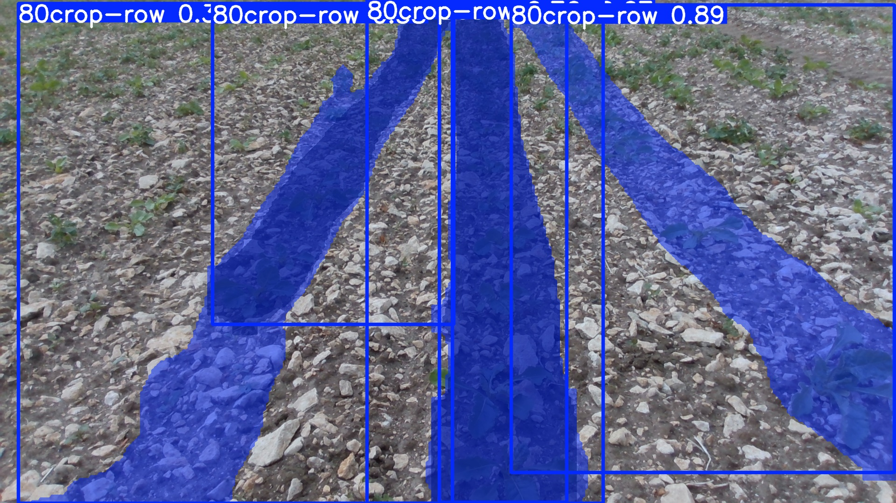
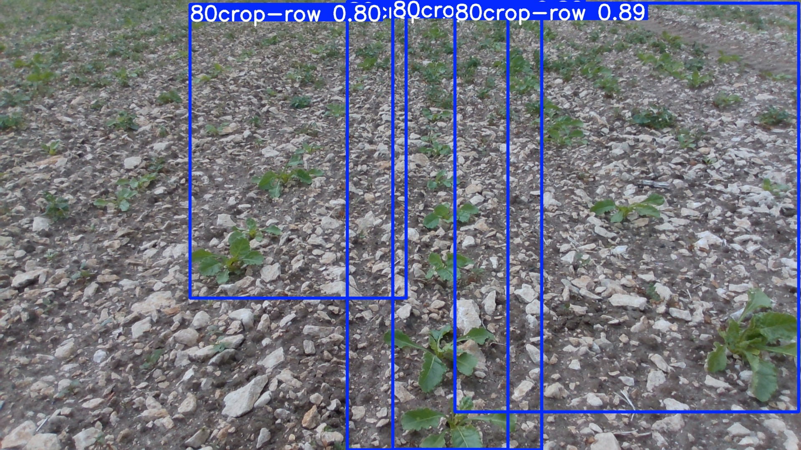

# YOLOv8 Crop-Row Segmentation on ZCU104/PYNQ using NCNN

This repository contains an **ARM-only deployment of a custom YOLOv8 segmentation model for crop-row segmentation** on the AMD/Xilinx **ZCU104** running a PYNQ-based Linux image.

The model is converted from PyTorch (`.pt`) to **NCNN** and executed on the ZCU104 **ARM Cortex-A53 processing system (PS)**. The FPGA programmable logic (PL) and Vitis-AI DPU are **not used in this version**.

## Project goals

The project was built to:

- deploy a custom YOLOv8 segmentation model on ZCU104 without using the DPU;
- verify that the NCNN model preserves the segmentation masks produced by the original PyTorch model;
- run crop-row segmentation on still images and video on the ARM cores;
- compare PyTorch and NCNN outputs before moving to hardware deployment;
- provide a CPU/ARM baseline for later DPU/Vitis-AI acceleration experiments.

## Deployment architecture

```text
                    PC / Ubuntu
                        |
                croprow_coco_s.pt
                        |
                Ultralytics export
                        |
                        v
          croprow_coco_s_ncnn_model/
                        |
                     SCP/SD
                        |
                        v
                ZCU104 + PYNQ
        +-------------------------------+
        | ARM Cortex-A53 (Processing)   |
        |                               |
        | OpenCV -> NCNN -> Postprocess |
        |          YOLOv8-Seg           |
        +-------------------------------+
                        |
                        v
                Mask / output video
```

> **Important:** this repository uses the ARM processor only. It is not a Vitis-AI/DPU implementation.

## Repository structure

```text
yolov8_segmention_croprow/
├── compare_mask_debug/          # Detailed PT/NCNN mask comparison outputs
├── croprow_coco_s_ncnn_model/   # Exported NCNN model used for deployment
├── zcu104_output/               # Results produced on ZCU104
├── zcu104_test/                 # ZCU104-side source/test files
│
├── check_model.py               # Check original PyTorch segmentation model
├── compare_pt_ncnn_mask.py      # Compare PT and NCNN masks numerically/visually
├── test_ncnn_mask.py            # Test exported NCNN model on the PC
│
├── croprow_coco_s.pt            # Main trained crop-row YOLOv8-Seg model
├── croprow_nano.pt              # Additional/lightweight model checkpoint
│
├── test.png                     # Test image
├── test_video.mp4               # Test video
├── pc_croprow_result.jpg        # PyTorch result on PC
└── ncnn_pc_croprow_result.jpg   # NCNN result on PC
```

The current repository layout can be viewed directly on GitHub.

## Model validation on PC

Before deploying to the board, the PyTorch and NCNN models are checked on the same input image.

### 1. Check the original `.pt` model

```bash
python3 check_model.py
```

The script verifies the task, class information and segmentation output, and saves:

```text
pc_croprow_result.jpg
```

Example:



### 2. Test the NCNN model

```bash
python3 test_ncnn_mask.py
```

The script loads:

```text
croprow_coco_s_ncnn_model/
```

and saves:

```text
ncnn_pc_croprow_result.jpg
```

Example:



### 3. Compare PyTorch and NCNN masks

```bash
python3 compare_pt_ncnn_mask.py
```

The comparison script runs both models on the same image and stores overlay images, binary masks and NumPy masks in:

```text
compare_mask_debug/
```

For each predicted object it also reports information such as confidence, mask area and mask value range. This step is useful for confirming that errors observed on the ZCU104 are not caused by the PyTorch-to-NCNN conversion.

## Exporting the model to NCNN

With a compatible Ultralytics environment, the model can be exported with:

```bash
yolo export \
  model=croprow_coco_s.pt \
  format=ncnn \
  imgsz=640
```

or in Python:

```python
from ultralytics import YOLO

model = YOLO("croprow_coco_s.pt")
model.export(format="ncnn", imgsz=640)
```

The exported directory is then used by the board-side NCNN application.

> Use the same input size and preprocessing convention during validation and deployment. If a different image size is used for the board application, update the preprocessing and post-processing accordingly.

## ZCU104/PYNQ deployment

### Hardware

- AMD/Xilinx ZCU104
- Zynq UltraScale+ MPSoC
- ARM Cortex-A53 Processing System
- SD card with PYNQ/Linux image

### Software

- Linux/PYNQ on ZCU104
- NCNN
- OpenCV
- C/C++ toolchain (`g++`, `cmake`)

For this implementation, NCNN should be built for CPU inference. Vulkan is not required.

A typical NCNN build configuration is:

```bash
git clone --depth=1 https://github.com/Tencent/ncnn.git
cd ncnn
git submodule update --init

mkdir -p build
cd build

cmake \
  -DNCNN_VULKAN=OFF \
  -DNCNN_BUILD_TOOLS=ON \
  -DNCNN_BUILD_EXAMPLES=OFF \
  ..

make -j4
sudo make install
```

Install OpenCV/build dependencies as required by the PYNQ image.

## Copying the model to ZCU104

Example from the development PC:

```bash
scp -r croprow_coco_s_ncnn_model \
  root@<ZCU104_IP>:/home/root/croprow/
```

The board-side source and test files in `zcu104_test/` can be copied in the same way.

```bash
scp -r zcu104_test \
  root@<ZCU104_IP>:/home/root/croprow/
```

## ARM-only inference pipeline

The board performs all stages on the ARM processor:

```text
Input image/video
      |
      v
OpenCV preprocessing
      |
      v
NCNN YOLOv8-Seg inference
      |
      v
Detection decoding + NMS
      |
      v
Mask reconstruction
      |
      v
Resize / threshold / overlay
      |
      v
Output image/video
```

Unlike a DPU implementation, both neural-network inference and segmentation post-processing are executed by the ARM cores.

## Results

The ARM/NCNN implementation successfully produces crop-row masks on the ZCU104 and was also tested with video input. Result files are stored under:

```text
zcu104_output/
```

In the tested configuration, processing was approximately **2.6 s per frame** for the ARM-only pipeline. This value is an experimental reference rather than a fixed benchmark; performance depends on input resolution, model version, NCNN/OpenCV build options and post-processing settings.

The main advantage of this implementation is that the segmentation result stays close to the original model while requiring no custom FPGA bitstream or DPU compilation.

The main limitation is inference speed because the entire YOLOv8-Seg pipeline runs on the ARM processing system.

## PyTorch vs NCNN vs ZCU104 ARM

| Stage | Runtime | Purpose |
|---|---|---|
| PyTorch `.pt` | PC CPU/GPU | Reference segmentation result |
| NCNN model | PC CPU | Verify model conversion |
| NCNN model | ZCU104 ARM | Final ARM-only embedded deployment |

This separation makes it easier to locate accuracy problems:

- if PT and NCNN differ on the PC, investigate the export/conversion step;
- if PT and NCNN match on the PC but the ZCU104 result differs, investigate board-side preprocessing/post-processing;
- if all results are similar but execution is slow, the limitation is primarily ARM computational performance.

## Current scope

This repository focuses on the **PYNQ + ARM + NCNN** implementation.

A separate Vitis-AI/DPU deployment can be developed to accelerate the CNN portion of YOLOv8-Seg, but it requires model quantization, DPU-compatible graph conversion and ARM-side post-processing for detection/mask reconstruction.

## Notes

- The repository name uses `segmention`; it is retained to preserve the existing GitHub URL.
- The project is intended primarily for experimentation and embedded-AI deployment research.
- Large model/video files may be better managed with Git LFS if the repository grows.

## Author

**dgvu**

GitHub: https://github.com/dgvu

